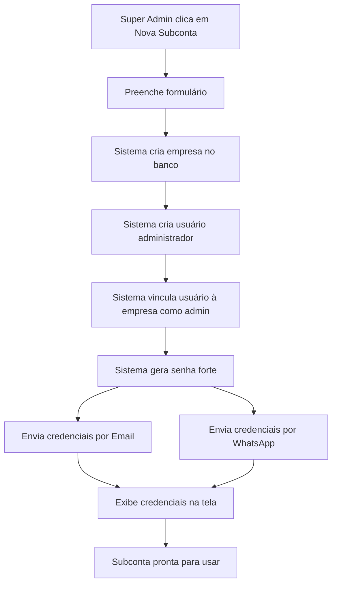
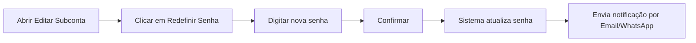
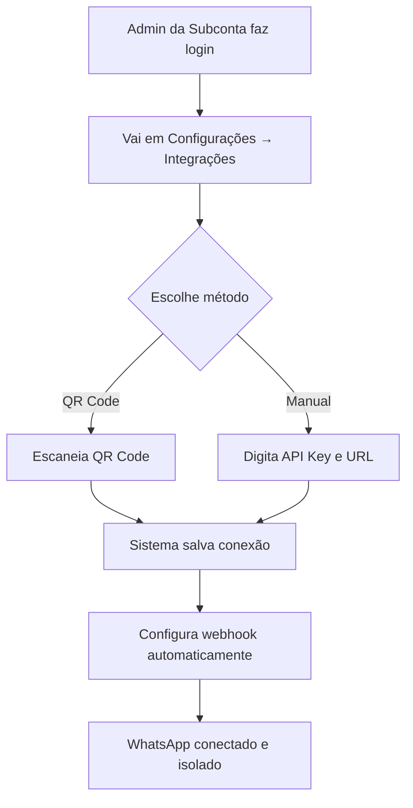

# 🏢 Guia Completo de Gestão de Subcontas

## 📋 Visão Geral

Este CRM é um **SaaS Multi-tenant** onde:
- **Conta Principal/Mestre**: Tem acesso total ao sistema e gerencia todas as subcontas
- **Subcontas**: Empresas clientes que possuem sua própria licença isolada do CRM

## 🎯 Estrutura de Contas

### Conta Principal (Super Admin)
- ✅ Acesso a **todas as funcionalidades** do sistema
- ✅ Pode **criar, editar e excluir** subcontas
- ✅ Visualiza e gerencia todas as subcontas criadas
- ✅ Controla limites de usuários, leads e planos de cada subconta
- ✅ Ativa/desativa subcontas conforme necessário

### Subcontas (Company Admin)
- ✅ Ambiente **totalmente isolado** e independente
- ✅ Banco de dados **separado por company_id**
- ✅ Conexão WhatsApp **própria e exclusiva**
- ✅ Usuários e permissões **próprios**
- ✅ Não tem acesso aos dados de outras subcontas

---

## 🆕 Criar Nova Subconta

### Dados Necessários

1. **Nome do Responsável** (obrigatório)
   - Nome completo do administrador da empresa

2. **E-mail para Login** (obrigatório)
   - Email único que será usado para login no sistema
   - Deve ser um email válido e ativo

3. **Senha** (gerada automaticamente)
   - Sistema gera senha forte automaticamente
   - Enviada por email e WhatsApp

4. **Telefone** (opcional, mas recomendado)
   - Para envio das credenciais via WhatsApp
   - Formato: (XX) XXXXX-XXXX

5. **Dados da Empresa**
   - Nome da empresa
   - CNPJ (opcional)
   - Plano contratado (Free, Básico, Premium)
   - Limites de usuários e leads

### Processo de Criação



### O Que Acontece Automaticamente

1. ✅ **Empresa criada** na tabela `companies`
2. ✅ **Usuário administrador criado** no Supabase Auth
3. ✅ **Role vinculada** como `company_admin` na tabela `user_roles`
4. ✅ **Senha forte gerada** automaticamente
5. ✅ **Credenciais enviadas** por:
   - 📧 Email (se configurado)
   - 📱 WhatsApp (se telefone fornecido)
6. ✅ **Credenciais exibidas** na tela (única vez)

### Exemplo de Mensagem Enviada

```
🎉 Bem-vindo ao CRM CEUSIA!

Sua subconta foi criada com sucesso!

📋 Dados da Conta:
• Nome: João Silva
• Empresa: Empresa ABC Ltda
• E-mail: joao@empresaabc.com

🔐 Credenciais de Acesso:
• URL: https://seu-crm.com
• E-mail: joao@empresaabc.com
• Senha: Abc123!@#xyz456

⚠️ IMPORTANTE: Guarde esta senha em local seguro. 
Recomendamos alterar sua senha no primeiro acesso.

📱 Próximos Passos:
1. Acesse o sistema usando o link acima
2. Faça login com suas credenciais
3. Configure sua instância WhatsApp em Configurações → Integrações
4. Comece a usar o CRM!
```

---

## ✏️ Editar Subconta

### O Que Pode Ser Editado

1. **Informações da Empresa**
   - Nome da empresa
   - CNPJ
   - Responsável
   - Email de contato
   - Telefone

2. **Configurações da Licença**
   - Plano (Free, Básico, Premium)
   - Limite de usuários
   - Limite de leads

3. **Status da Conta**
   - Ativar/Desativar
   - Quando desativada, usuários não conseguem fazer login

4. **🔐 Redefinir Senha do Administrador**
   - Gera nova senha
   - Envia automaticamente por email e WhatsApp
   - Notifica o usuário sobre a alteração

### Como Redefinir Senha



---

## 🔐 Segurança e Isolamento

### Isolamento de Dados

Todas as tabelas do sistema possuem `company_id` e RLS (Row Level Security):

```sql
-- Exemplo de política RLS
CREATE POLICY "Company users manage leads"
ON public.leads
FOR ALL
USING (user_belongs_to_company(auth.uid(), company_id));
```

### Funções de Segurança

1. **`user_belongs_to_company(user_id, company_id)`**
   - Verifica se usuário pertence à empresa
   - Usado em todas as políticas RLS

2. **`has_role(user_id, role)`**
   - Verifica se usuário tem role específica
   - Security definer para evitar recursão

3. **`get_user_company_id(user_id)`**
   - Retorna company_id do usuário
   - Usado para filtrar dados

### Hierarquia de Permissões

```
super_admin (Conta Principal)
    ├── Acesso total ao sistema
    ├── Gerencia todas as subcontas
    └── Pode criar/editar/excluir qualquer coisa

company_admin (Administrador da Subconta)
    ├── Acesso total à sua empresa
    ├── Gerencia usuários da empresa
    ├── Gerencia dados da empresa
    └── NÃO vê dados de outras empresas

user (Usuário Normal)
    ├── Acesso aos dados da empresa
    ├── Permissões configuráveis
    └── Limitado por RLS e permissões
```

---

## 📱 Configuração WhatsApp por Subconta

### Cada Subconta Precisa

1. **Instância Própria na Evolution API**
   - Nome único da instância
   - API Key própria
   - URL da Evolution API

2. **Webhook Configurado**
   - Aponta para o edge function `webhook-conversas`
   - Envia automaticamente o company_id

### Processo de Conexão WhatsApp



### Armazenamento da Conexão

```sql
-- Tabela whatsapp_connections
company_id          -- Identifica a subconta
instance_name       -- Nome único da instância
evolution_api_key   -- API Key específica desta instância
evolution_api_url   -- URL da Evolution API
status              -- connected/disconnected
```

---

## 📊 Gestão de Usuários da Subconta

### Adicionar Usuários à Subconta

O administrador da subconta pode adicionar novos usuários através do diálogo "Gerenciar Usuários":

1. Informar email do novo usuário
2. Definir role (user, moderator, etc)
3. Sistema cria o usuário e vincula à empresa

### Roles Disponíveis

- **company_admin**: Administrador da empresa
- **user**: Usuário padrão
- **moderator**: Moderador (permissões intermediárias)

---

## 🎯 Boas Práticas

### Para Super Admin (Conta Principal)

1. ✅ **Sempre fornecer telefone** ao criar subcontas
   - Garante recebimento das credenciais via WhatsApp
   
2. ✅ **Anotar credenciais** exibidas na tela
   - Senha é mostrada apenas uma vez
   
3. ✅ **Configurar limites adequados**
   - Plano, usuários e leads conforme contratado
   
4. ✅ **Orientar cliente** sobre próximos passos
   - Enviar guia de configuração WhatsApp

### Para Admin da Subconta (Cliente)

1. ✅ **Alterar senha no primeiro acesso**
   - Usar senha forte e única
   
2. ✅ **Configurar WhatsApp imediatamente**
   - Seguir guia em CONFIGURACAO_SUBCONTAS_WHATSAPP.md
   
3. ✅ **Usar instância própria**
   - Nunca compartilhar API Key com outras empresas
   
4. ✅ **Gerenciar usuários com cuidado**
   - Adicionar apenas usuários confiáveis

---

## 🔧 Troubleshooting

### "Não recebi as credenciais"

1. Verificar se email está correto
2. Verificar se telefone está no formato correto
3. Verificar spam/lixo eletrônico
4. Pedir ao admin para reenviar ou redefinir senha

### "Não consigo fazer login"

1. Verificar se a subconta está ativa
2. Verificar se email/senha estão corretos
3. Limpar cache do navegador
4. Pedir ao admin para redefinir senha

### "WhatsApp não está conectando"

1. Verificar se API Key está correta
2. Verificar se instância está ativa na Evolution API
3. Verificar se webhook está configurado
4. Ver logs em CONFIGURACAO_SUBCONTAS_WHATSAPP.md

### "Não vejo dados de outras empresas"

✅ **Isso é correto!** Cada subconta é isolada e só vê seus próprios dados.

---

## 📝 Checklist de Criação de Subconta

- [ ] Nome do responsável preenchido
- [ ] Email válido e único
- [ ] Telefone no formato correto (recomendado)
- [ ] Nome da empresa definido
- [ ] Plano selecionado (Free/Básico/Premium)
- [ ] Limites de usuários configurados
- [ ] Limites de leads configurados
- [ ] Credenciais anotadas após criação
- [ ] Credenciais enviadas por email/WhatsApp
- [ ] Cliente orientado sobre próximos passos

---

## 🆘 Suporte

Para dúvidas ou problemas:

1. Consultar documentação completa
2. Verificar logs do sistema (Cloud → Functions)
3. Contatar equipe de suporte

---

**Última atualização:** 2025-10-25
