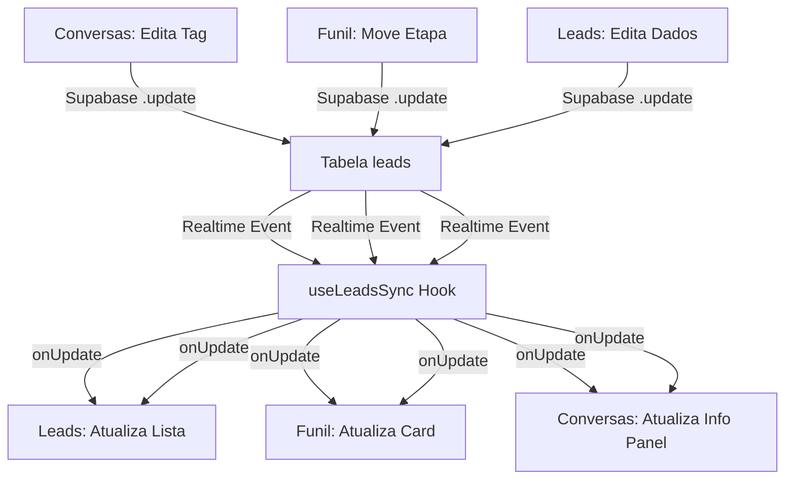

# Sincronização em Tempo Real - Conversas ↔ Leads ↔ Funil

## 📡 Visão Geral

Sistema de sincronização bidirecional entre os módulos **Conversas**, **Leads** e **Funil de Vendas** usando Supabase Realtime.

Todas as alterações feitas em qualquer módulo são propagadas instantaneamente para os outros módulos conectados.

---

## 🔧 Arquitetura

### Hook Global: `useLeadsSync`
**Arquivo:** `src/hooks/useLeadsSync.ts`

Gerencia a sincronização observando mudanças na tabela `leads` via Supabase Realtime:
- **INSERT**: Quando um novo lead é criado
- **UPDATE**: Quando dados do lead são modificados  
- **DELETE**: Quando um lead é removido

```typescript
useLeadsSync({
  onInsert: (newLead) => { /* handle */ },
  onUpdate: (updatedLead, oldLead) => { /* handle */ },
  onDelete: (deletedLead) => { /* handle */ },
  showNotifications: true // Mostrar toasts de sincronização
});
```

---

## 📋 Módulos Integrados

### 1️⃣ Conversas (`src/pages/Conversas.tsx`)

**Funcionalidades Sincronizadas:**
- ✅ Editar Tags do Lead (Info Panel)
- ✅ Atribuir Responsável
- ✅ Adicionar ao Funil / Mudar Estágio
- ✅ Editar Informações (Produto, Valor, Anotações)

**Como Funciona:**
1. Usuário edita informações no **Info Panel** (painel lateral)
2. Sistema busca/cria lead correspondente no Supabase via `findOrCreateLead()`
3. Atualiza dados na tabela `leads` com `.update()`
4. **Realtime propaga** mudanças para Leads e Funil

**Mapeamento:**
- `conversas.phoneNumber` → `leads.phone` ou `leads.telefone`
- `conversas.tags` → `leads.tags`
- `conversas.funnelStage` → `leads.stage`
- `conversas.produto` → `leads.servico`
- `conversas.valor` → `leads.value`
- `conversas.anotacoes` → `leads.notes`

---

### 2️⃣ Leads (`src/pages/Leads.tsx`)

**Funcionalidades Sincronizadas:**
- ✅ Recebe atualizações quando lead é editado em Conversas
- ✅ Recebe atualizações quando lead é movido no Funil
- ✅ Notifica quando novo lead é criado
- ✅ Remove lead da lista quando deletado

**Como Funciona:**
1. Hook `useLeadsSync` escuta mudanças na tabela `leads`
2. Quando evento ocorre, atualiza `state` local com `setLeads()`
3. Interface reflete mudanças instantaneamente

**Callbacks:**
```typescript
onInsert: adiciona novo lead no topo da lista
onUpdate: substitui lead existente com dados atualizados
onDelete: remove lead da lista
```

---

### 3️⃣ Funil de Vendas (`src/pages/Kanban.tsx`)

**Funcionalidades Sincronizadas:**
- ✅ Mover lead entre etapas (Drag & Drop)
- ✅ Recebe atualizações de tags/dados editados em Conversas
- ✅ Recebe atualizações de leads criados/editados
- ✅ Atualiza etapa quando alterada em Conversas

**Como Funciona:**
1. Usuário arrasta card de lead para nova coluna
2. Sistema atualiza `etapa_id`, `funil_id` e `stage` no Supabase
3. **Realtime propaga** para Conversas e Leads
4. Todos os módulos refletem a nova posição do lead

**Atualização no Drag:**
```typescript
.update({ 
  etapa_id: novaEtapaId,
  funil_id: etapaDestino.funil_id,
  stage: etapaDestino.nome.toLowerCase()
})
```

---

## 🔄 Fluxo de Sincronização



---

## 🎯 Benefícios

✅ **Consistência de Dados**: Todos os módulos sempre mostram informações atualizadas  
✅ **Experiência em Tempo Real**: Mudanças visíveis instantaneamente  
✅ **Sem Duplicação**: Hook centralizado evita código repetido  
✅ **Escalável**: Fácil adicionar novos módulos à sincronização  
✅ **Robusto**: Tratamento de erros e rollback em falhas  

---

## 🔐 Segurança

- **RLS (Row Level Security)** garante que cada usuário só vê leads da sua empresa
- **company_id** validado em todas as operações
- **Autenticação** obrigatória via Supabase Auth

---

## 🧪 Testando a Sincronização

### Teste 1: Conversas → Leads
1. Abra uma conversa no menu **Conversas**
2. Clique em "Adicionar Tag" no Info Panel
3. Digite uma tag e salve
4. Navegue para **Leads**
5. ✅ Verifique se a tag aparece no card do lead

### Teste 2: Funil → Conversas
1. Abra o **Funil de Vendas**
2. Arraste um lead para outra etapa
3. Navegue para **Conversas** e abra a conversa desse lead
4. ✅ Verifique se o "Estágio do Funil" está atualizado

### Teste 3: Conversas → Funil
1. Abra uma conversa no menu **Conversas**
2. Clique em "Editar Informações" no Info Panel
3. Altere o Valor da Negociação
4. Navegue para **Funil de Vendas**
5. ✅ Verifique se o valor no card foi atualizado

---

## 📚 Logs de Debug

Para acompanhar a sincronização, monitore o console:

```javascript
// Conversas
📡 [Conversas] Lead atualizado via sync: {...}

// Leads  
📡 [Leads] Novo lead adicionado via sync: {...}
📡 [Leads] Lead atualizado via sync: {...}

// Funil
📡 [Funil] Lead atualizado via sync: {...}
🔄 Sincronização automática vai propagar para Conversas e Leads
```

---

## 🚀 Próximos Passos

- [ ] Adicionar sincronização de status (Aguardando, Respondido, Resolvido)
- [ ] Sincronizar anotações internas entre módulos
- [ ] Implementar histórico de mudanças do lead
- [ ] Adicionar websocket para notificações push
- [ ] Criar dashboard de sincronização em tempo real

---

## 💡 Observações Importantes

⚠️ **Não interferir no envio/recebimento de mensagens via Evolution API**  
✅ **Todas as funções existentes permanecem intactas**  
✅ **Sincronização é adicional, não substitui funcionalidades**  
✅ **Performance otimizada com debounce e cache local**
